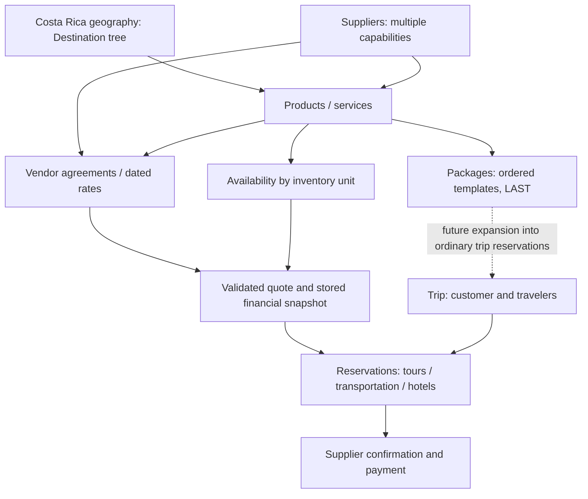

# VV final platform architecture

Decision date: 2026-09-07. This extends the existing platform; it does not replace Milestones 0–5. **Costa Rica is the business scope. Arenal/La Fortuna is a launch market. Phases control rollout, not the underlying architecture.**

| Launch phase | Customer activation |
| --- | --- |
| Phase 1 — Tours | Active today through the existing tour APIs and public website |
| Phase 2 — Transportation | Future reviewed canonical routes, vendor services, schedules, quotes and reservation details |
| Phase 3 — Hotels | Future contracted properties, room/rate plans, stay pricing and availability |
| Phase 4 — Packages | Last: compose the earlier inventory and reservation capabilities |

The following diagram is the intended business relationship, not a claim that every box is implemented:



## Repository findings and decisions made before code changes

The inspection covered the models, all five existing migrations, inventory/booking/availability/payment routers and services, Operations pages/components, public contracts, regression tests, legacy-audit package and permanent-preview preparation. The pre-edit implementation plan was recorded locally in `/tmp/vv-foundation-review/plan.md`.

| Finding | Consequence if generalized blindly | Decision |
| --- | --- | --- |
| `Product.product_type` already exists; tours use `tours_query()` and `TourInput` explicitly | Removing the tour filter would expose unfinished product types | Retain the filter and public schemas; add typed services behind separate future activation gates |
| `Product.location` is free text; homepage/seed copy focuses on Arenal | Free-text locations cannot reliably join suppliers, transport stops and nationwide inventory | Add a Destination tree and optional ProductDestination links; preserve copy and location strings |
| Supplier has one `supplier_type` and an `active` flag | A multi-service vendor or hotel prospect cannot be classified safely with one label | Keep both legacy fields; add independent capability rows and relationship status |
| Product retail/net cost are single Decimal values | No effective dates, contract context or historical vendor rates | Add internal agreement/fixed-rate references; leave the existing booking snapshot path authoritative |
| Availability is keyed by product/date and its commands require tours | One hotel night/room or shuttle departure cannot safely share a whole-tour capacity counter | Keep current availability semantics; use typed inventory-unit extensions later |
| Trip already has many Reservations with Product and supplier snapshot FKs | A second trip system would duplicate customers, travelers and payment linkage | Keep Trip → Reservation as the component graph |
| Tour request creates one Trip/Reservation; names include `tour_name_snapshot`, `tour_slug`, and tour-oriented messages | These are launch adapters, not a generic multi-component request contract | Preserve compatibility; introduce typed intake/detail projections in their own phases |
| PayPal pays one immutable reservation snapshot and has real sandbox acceptance history | Package totals or hotel nights cannot be passed through `unit_price × quantity` without explicit pricing semantics | Preserve current checkout; require typed quote snapshots and allocation design before new payable component types |
| Preview/production omit all `/ops/*` routes; Operations lacks app authentication | New reference APIs must not bypass the deployment boundary | Mount foundation routes inside the same development-only gate |
| Legacy audit contains unverified commercial/media facts, not approved catalog data | Importing audit records would imply commercial approval | Leave the audit unchanged and keep controlled import separate |

The current sandbox acceptance is recorded in [Milestone 5 acceptance](milestone-5-sandbox-acceptance.md). Permanent deployment remains provider-dependent as documented in [cloud deployment](cloud-deployment.md). This architecture work does not reconfigure credentials, register webhooks, collect payments or provision cloud services.

## Decision matrix

**IMPLEMENT NOW** means schema and internal commands exist. **PREPARE NOW** means a concrete extension contract is documented without a feature implementation. **DEFER** means no schema/API/UI is created for the concept.

| Concept | Decision | Current scope / activation condition |
| --- | --- | --- |
| Destination hierarchy | IMPLEMENT NOW | Parent/child model, internal commands, explicit Costa Rica reference seed |
| Product geography | IMPLEMENT NOW | Optional many-to-many links; no inferred mapping or public change |
| Supplier multi-service and relationship status | IMPLEMENT NOW | Capability set + independent pipeline status; old editor remains compatible |
| Agreement headers / fixed dated rates | IMPLEMENT NOW | Internal reference records only; no automatic resolver or price changes |
| Supplier documents | IMPLEMENT NOW | Private metadata and stable references; no binary storage/fetching |
| Executable rate selection / quote provenance | PREPARE NOW | Explicit supplier/date/unit/currency selection and immutable quote snapshots required |
| Transport nodes / canonical routes / vendor mapping | PREPARE NOW | Reviewed RideCR universe; Interbus overlap only; no import |
| Transport services / schedules / pricing | PREPARE NOW | Product-backed offers with departure-specific inventory; no booking UI |
| Hotel property / vendor contracting | PREPARE NOW | Property identity separate from contracting supplier and sellable room offer |
| Room types / seasonal hotel pricing engine | DEFER | Defined below; implement only in hotel phase |
| Mixed Trip/Reservation graph | PREPARE NOW | Reuse existing graph with typed details; no destructive rename or duplicate core |
| Packages | DEFER | Ordered template components only in design; no placeholder table needed |
| Internal users / authorization | PREPARE NOW | Roles/capabilities/ownership design; authentication implementation separate |
| Task engine / dashboard profiles | PREPARE NOW | Shared tasks and permission-filtered views; no workflow engine or dashboard redesign |
| Customer accounts | DEFER | Separate identity boundary from internal users |
| Unfinished public product types | DEFER | Remain inaccessible; feature gate AND eligible published inventory before activation |

## Geography and product associations — implemented

`Destination(id, parent_id?, name, slug, destination_type, description?, active, sort_order, created_at, updated_at)` supports country, region, destination, city, zone and airport nodes. Slugs are globally unique. No GIS, coordinates or fixed-depth hierarchy is required. Geography is a navigational/business taxonomy, not a transport route graph.

Parent IDs reference real nodes. Self/ancestor cycles are rejected; PostgreSQL serializes tree writes so concurrent reciprocal reparenting cannot introduce a cycle. Referential constraints prevent dangling parents. Reparenting is available internally; there is no deletion endpoint. Deactivation does not cascade, remove historical associations, unpublish tours, or change booking eligibility. Any future public destination browser must deliberately consider ancestor visibility.

The editable JSON reference catalog is `services/api/app/data/costa-rica-destinations.json`, not hardcoded application branching. It contains Costa Rica; San José/Central Valley, Arenal/La Fortuna, Monteverde, Guanacaste with Papagayo/Tamarindo/Nosara/Las Catalinas, Manuel Antonio/Central Pacific, Uvita/South Pacific, Osa, Caribbean/Puerto Viejo, Bijagua/Tenorio, Pacuare/Turrialba, and SJO/LIR airport references.

```bash
docker compose exec api python -m app.seed_destinations --confirm-reference-data
```

This explicit, transactional, insert-only seed creates 18 reference nodes, preserves operator edits, refuses conflicting parent/type definitions and can be repeated safely. It runs neither at startup nor inside the migration. On a fresh preview, run the existing empty-inventory seed **before** the geography seed, because the former deliberately requires all application tables to be empty.

`ProductDestination(product_id, destination_id)` has a composite primary key. A product may span multiple destinations and may remain unmapped. Existing `location` text and tour output remain unchanged. The mapping command validates the entire set before replacing it atomically; old tour PUT requests cannot erase these separate relationships. No claim is made that current demo/legacy locations were verified or mapped.

## Supplier relationships and commercial references — implemented foundation

Supplier remains the common vendor identity. Its old `supplier_type` stays a legacy descriptive classification, not a capability constraint. `SupplierService` permits the same supplier to have tour, transportation and hotel capabilities simultaneously. Empty means unreviewed/unspecified; no capability is inferred from a vendor name or claimed hotel connection.

The new relationship statuses are `prospect`, `contacted`, `rates_requested`, `rates_received`, `negotiating`, `contracted`, `active`, `inactive`, and `declined`. Existing suppliers receive `prospect` until deliberately reviewed. This **does not deactivate their existing tours**: the old active flag, publication, supplier confirmation and commercial relationship status are separate concepts. A future pipeline UI should show that distinction. Existing supplier forms cannot overwrite the new fields because a separate internal command owns them. Status is currently a manual reference value, not an audited CRM transition or authenticated approval.

`SupplierAgreement` stores supplier, title, effective dates, currency (USD or CRC), recorded status and private notes. `ProductRate` stores agreement, Product, label, effective period, unit basis (`per_person`, `per_vehicle`, `per_night`), net amount and optional retail amount. Currency is inherited from the agreement; no conversion is performed. Money remains Decimal/NUMERIC. Rate dates must fit within agreement dates; a Product must belong to the agreement's supplier when the reference is recorded.

These records are deliberately **append-only through the API**: no commercial edit/delete endpoint, approval workflow or executable rate resolver exists. They can retain successive vendor quotes without overwriting a timeless number. Overlapping quotes and conflicting versions may coexist as reference evidence and must not be automatically selected. Status `approved` records an operator assertion; it does not activate inventory or implement owner authorization. A controlled amendment/supersession/review workflow is a prerequisite to executable pricing.

The agreement's supplier remains the historic vendor even if a Product is later reassigned. A future resolver must match current fulfillment supplier and service, agreement/version, service dates, unit basis, currency, occupancy/passenger rules, and approval/expiry; it must reject gaps and ambiguous overlaps. Never select the newest row silently. Store selected rate/version and resolved retail/net/tax/currency breakdown on the Reservation quote snapshot. Changes afterward never rewrite booked economics.

For now **`Product.supplier_cost`, Product retail price, existing margin calculation, Reservation unit price/cost and PayPal amount calculation are unchanged**. No rate is used for checkout. CRC commercial references do not enable CRC checkout. A future tour-rate migration should first compare explicit dated quotes in a dry run, then enable selection only for reviewed mapped products. Legacy unmapped tours continue the documented snapshot path until deliberately migrated.

`SupplierDocument` stores supplier, optional same-supplier agreement, type (contract/rate sheet/terms/cancellation policy/media kit), title, optional stable HTTPS URL or logical storage key, dates, private notes and timestamps. URLs reject embedded credentials, query strings and fragments; no URL is fetched by FastAPI. No upload, binary storage, signed-link generation or external sharing occurs. Metadata may describe a requested document whose reference has not arrived. Do not store passwords, app secrets, access tokens or expiring signed URLs in titles, notes, paths or URLs. Future storage should generate short-lived access URLs after authorization rather than persist credentials.

### Internal foundation API

Every route is under the existing development-only `/ops` gate with `no-store` responses; preview/production do not mount them. No new public endpoint or Operations screen was added.

| Route | Methods and purpose |
| --- | --- |
| `/ops/destinations` | GET list, POST create |
| `/ops/destinations/{id}` | PUT validated tree edit |
| `/ops/products/{id}/destinations` | GET associations, PUT `{"destination_ids":[...]}`; empty array deliberately clears |
| `/ops/suppliers/{id}/foundation` | GET/PUT `relationship_status` and distinct `service_types` |
| `/ops/suppliers/{id}/agreements` | GET/POST immutable agreement references |
| `/ops/agreements/{id}/rates` | GET/POST dated fixed-unit rate references |
| `/ops/suppliers/{id}/documents` | GET/POST document metadata |

Full request fields and validation are in `foundation_schemas.py` and development OpenAPI. Existing public allowlists, booking/payment routes, supplier/tour forms, and exact public response fields remain unchanged. Foundation records do not grant checkout eligibility or publish a service type.

## Transportation — prepared, no routes imported

**Business rule supplied by VV:** RideCR's reviewed, relevant Costa Rica route set defines the canonical VV universe. Interbus is mapped only where it serves those same canonical routes. Do not import its entire 180+ route network. This task performs no scraping, route import, schedule verification or supplier contact.

The future model is:

```text
Supplier with transportation capability
  → canonical VV Route
  → vendor TransportService (Product-backed sellable offer)
  → effective Schedule / departure / exception
  → vendor agreement + dated rate
```

- **TransportNode:** stable ID, destination FK, type (airport/town/zone/hotel pickup), name and optional pickup instructions. Destination describes geography; node describes an operational endpoint. Hotel-specific pickup nodes can be added later without splitting geographic destinations into every building.
- **TransportRoute:** directed origin/destination node FKs, active flag and route provenance/version. Reverse travel is a distinct route. Review RideCR variants before deduplicating; lake crossings belong to a typed service/variant where operationally distinct. Canonical route identity must not be vendor display text.
- **VendorRouteMapping:** supplier, provider's stable route reference, canonical VV route FK and verification/provenance. An Interbus service must reference an already accepted canonical route; missing overlap is an exception for review, not permission to expand the universe.
- **TransportService:** supplier + canonical route + mode (shared/private/lake crossing), Product FK and fulfillment rules. RideCR and Interbus offers share route identity while retaining independent suppliers, schedules and prices.
- **Schedule:** local departure time, Costa Rica timezone, weekday set, effective range, pickup-window bounds and estimated duration. Seasonal versions and explicit date exceptions/blackout status must override recurrence deterministically. A departure inventory unit carries actual seat/vehicle capacity; route-wide daily capacity is insufficient.
- **Rate:** per passenger or per vehicle with dated vendor net and VV retail; future child/age bands and passenger limits in typed details. Quote the requested departure, passengers and vehicle requirements server-side, and persist a complete snapshot. Do not multiply private vehicle prices by party size.

Phase 2 starts with reviewed canonical reference data and vendor overlap mapping, then schedules/rates and booking rules. Customer discovery, transfer forms and provider connectors remain deferred until those inputs are verified.

## Hotels — prepared, no active hotel inventory

The **19 Hyatt-connected properties are vendor prospects**, not contracted or published inventory. No property names, rates, availability or commercial relationships are imported by this task. Hyatt connection alone is not a supplier contract or a sellable room.

Future **HotelProperty** stores physical property identity, operator/supplier relationship, Destination, name, description, address, optional coordinates/category, amenities, local check-in/out policies, images and independent active/published flags. A **RoomType** belongs to a property and records occupancy limits, bedding, description, images and active status. The property itself is not the payable unit.

Vendor agreements can reference the property and the actual contracting/fulfillment supplier; a physical property may have multiple distribution agreements. A Product-backed room/rate-plan offer links room type and agreement. Extend fixed references with typed **HotelRatePlan/SeasonalRate** data: nightly dates, occupancy, extra-person and child bands, net/commission model, retail/markup, taxes/fees, currency, meal plan, minimum stay, blackout dates and cancellation terms. Do not overload a generic JSON column or Product duration with these rules.

Availability is for room type/rate plan/night or explicit allotment and stop-sell rules. Hotel stays consume the interval `[check_in, check_out)` across all nights; missing nights, occupancy violations or stop-sells prevent an automatic quote/confirmation. Preserve room count, guest allocation, every priced night, taxes and cancellation-policy version in typed reservation details. Room count, night count and travelers are separate quantities. Supplier confirmation remains per fulfillable component; nightly confirmation needs an explicit aggregation policy before payment readiness.

No hotel booking API, seasonal engine, property/room tables, channel manager, room search or hotel UI is created now. Binary hotel/room media handling remains separate from the current ProductImage gallery.

## Trips and reservations — keep the existing core

`Trip → many Reservations → Product` already accommodates more than one component and shares Customer/Traveler relationships. Keep it. Tour intake creating a new one-component trip is a current use case, not a database limit.

Before activating another product type, introduce a stable reservation component-kind snapshot and typed one-to-one details (TransportReservationDetail or HotelReservationDetail) with real FKs and validation. Freeze Product type after publication/references exist. Transport details include service/departure, pickup/dropoff and passenger/vehicle choices; hotel details include offer, check-in/out, rooms, occupancy and price breakdown. A shared component service owns idempotency, versioning, financial snapshots, supplier confirmation and reservation/trip locking; type-specific adapters own quote and fulfillment rules.

The existing `tour_name_snapshot` remains intact now. A later additive generic display snapshot can backfill from it and expose a compatibility alias to existing tour contracts. Do not rename public `tour_slug` or reinterpret quantity/time fields in place. Keep the existing reservation ID, trip ID, payment linkage and supplier event history. Evolve schema through forward additions, not a second reservation/payment system.

`unit_price × quantity` is valid for current tours, not every future component. Typed quoting must persist a resolved component total and cost breakdown before new types become payable. Retain legacy tour calculation for existing reservations; validate the new path separately, including Decimal currency and historic pricing. One-reservation PayPal checkout remains the present scope. Full-trip balance, payment allocation, refunds UI and package payment policies need a later explicit design; this task does not enable them.

Existing tour/date availability is advisory, not an allocation ledger. Extend inventory by service/room/departure and introduce explicit holds/releases only with the relevant phase. Do not route hotel nights or vehicle capacity through `save_availability` merely by removing its tour filter.

## Packages — last, design only

No placeholder package table is necessary: Product identity and Trip/Reservation composition already supply stable extension points. Future Package templates have name, destinations, nights, ordered/versioned itinerary, fixed/customizable flag and independent published status. PackageComponent references existing tour Product, transport service Product, or hotel room/rate-plan offer, with sequence/day offset, requested quantities and constraints.

At purchase, resolve current component quotes and availability, then materialize ordinary Reservations within one Trip with immutable component snapshots. Templates are not live reservations, and later template edits cannot rewrite an existing trip. Package retail, allocated component costs, discounts, margin, partial availability and cancellation/payment allocation require explicit policies. Never create a duplicate inventory or payment catalog for packages.

No package builder, API, booking flow, public/Operations page, dynamic itinerary engine, or package schema was implemented.

## Internal users, tasks and dashboard profiles — prepared only

Future internal identity uses a stable **InternalUser** tied to a trusted authentication subject, with active status, display name and role/capabilities. Roles: `owner_admin`, `operations_partner`, `staff`. Customer identities/accounts remain separate. Existing supplier-event `operator_identifier` is untrusted historical text; retain it and add authenticated actor linkage later instead of retroactively treating text as identity.

Owner/admin capabilities cover commercial approval, margins, finance visibility, exceptions and team assignment. Operations partner capabilities cover booking availability/confirmation, vendor outreach/rate requests, customer follow-up and assigned/shared tasks. Staff gets an explicitly narrower capability set later. Enforce permissions in API/services as well as navigation; dashboard profiles do not grant access themselves. Agreements, bookings, supplier work and approval events can reference assigned/created/reviewed internal users with timestamps and retained audit history.

Future **Task** supports title, description, assigned user, priority, status (`open`, `in_progress`, `waiting`, `completed`, `cancelled`), due date, source (`manual` or `system`), created/completed timestamps and a related entity reference. Expose entity type/ID at the contract boundary, but use validated typed FK links (booking/supplier/agreement) or a checked entity registry rather than unrestricted dangling polymorphic IDs. Validate tenant/team/record access before attachment or assignment.

Manual “Review Andaz rates” and generated tasks use the same model. Proposed triggers: new booking → check availability; rates received → owner review; overdue outreach → follow-up; agreement nearing expiration → request rates. A transaction/outbox plus deduplicated source-event key should create tasks after domain commits; scheduled reminders use deterministic agreement/expiry/rule keys. Retries must not create duplicate work. No queue, outbox, scheduler, task table/UI, email or supplier messaging is added now.

Future dashboards are permission-filtered views over the same records/tasks, borrowing only the **conceptual profile pattern** from Nova. No Nova code, dependencies, data model or service coupling is introduced. Owner/admin sees bookings, revenue/payments, margins, vendor pipeline, approvals, exceptions and personal/shared tasks. Operations partner sees new bookings, availability, supplier confirmations, vendor outreach/rate requests, follow-up and tasks. Staff will get a narrower view. Current Operations pages/layout remain unchanged.

## Public activation and privacy

Current navigation and public APIs expose Tours only. Future Transportation, Hotels and Packages require explicit server-side feature gates **and** reviewed published inventory; navigation should use the same capability decision. Do not infer activation merely because a Supplier has a hotel capability, a Destination is active, or a reference rate exists.

Keep private/public allowlists separate. Vendor net rates, agreements, documents, contacts, internal tasks/approvals and margins never belong in public catalog/payment output. Authentication remains a prerequisite for deploying Operations: preview/production currently omit its routes entirely, including the new foundation routes. **`apps/ops` and `/ops/*` are NOT production-safe until application authentication and authorization are implemented.**

## Migration, regression and next implementation

Forward revision **`0006_platform_foundation`** adds six tables and Supplier.relationship_status. It does not edit migrations 0001–0005 or update existing booking, price, availability, confirmation, payment or token values. Legacy capabilities and mappings remain empty; only the separate geography seed creates reference data. Downgrade refuses to discard commercial/geographic records; recover through a reviewed forward migration.

See [foundation validation](final-platform-architecture-validation.md) for actual regression results, data/file preservation and provider-test limits. Deployment configuration is unchanged. The disposable preview validator now applies 0006 and expects it as head; existing preview seeding remains explicitly ordered and safe.

**Recommended next implementation: Internal VV authentication and authorization for Operations.** Implement trusted sign-in, server-enforced owner/admin and operations-partner capabilities, protected Operations deployment, and authenticated actor linkage for supplier/booking/commercial actions. Prove private API denial and least-privilege behavior before enabling hosted Operations. Do not include tasks, transport imports, hotel UI or package features in that milestone. Once internal access is safe, implement the narrow vendor/geography review UI and approved tour mapping/rate review, then Phase 2's canonical transport reference catalog. Transactional receipts remain useful, but this repository's hosted Operations boundary is the immediate prerequisite for safely using the expanded vendor foundation.
