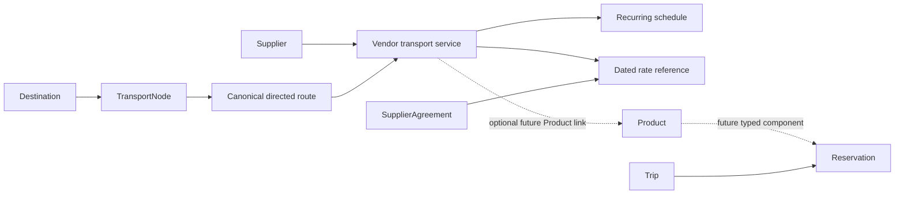

# Transportation Phase 1 architecture

Implemented 2026-09-07–08. This is an additive internal reference catalog under the [final platform architecture](../final-platform-architecture.md). Tours, historical reservations, payments and public publication rules retain their existing behavior.

## Identity and import

The forward migration is `0008_transportation_foundation`, following 0007. It creates five tables and extends the checked task relationship registry with `transport_route`. It alters no existing booking/payment columns, economics or historical migrations. Its downgrade refuses removal when transport-linked tasks remain; it never deletes task history to force a downgrade.

Nodes have stable unique slugs, display names, types, optional existing geography links, notes, active state and timestamps. There is no delete endpoint. Node slugs and route endpoints are immutable through editing; deactivate unsuitable records rather than repurposing history. Direction has a database uniqueness constraint; self-routes are rejected. Routes require official RideCR provenance. Vendor services use existing Supplier + transportation capability, and a unique supplier/route/type combination. Supplier relationship status is independent of capability and activation. Existing supplier notes, contracts, contacts and statuses are not overwritten.

The [reviewed catalog](ridecr-route-inventory.md) is explicit, insert-only and idempotent. New suppliers default to unreviewed commercial status; source retrieval does not imply a VV contract or approved pricing. No fleet model or speculative private/lake offer is seeded. Shared/private/lake/other types and nullable passenger capacity are supported for verified operator entry.

## Schedules and search

Recurring local wall-clock times use **America/Costa_Rica** (UTC−06:00). API inputs require local times without offsets; search returns offset-aware departure timestamps. Monday is 0 and Sunday 6. A checked seven-bit weekday set is stored compactly. An empty weekday set means **unknown**, not daily service. Source URLs, retrieval/verification timestamps, nullable effective dates, estimated duration, optional arrival, pickup windows, seasonal notes, active state and edit versions are retained.

`GET /ops/transportation/search?origin=ID&destination=ID&travel_date=YYYY-MM-DD&party_size=4&ready_time=11:20&buffer_minutes=60`

Search considers directed active routes, active endpoints/suppliers/services/schedules, known weekday recurrence, effective dates, known passenger capacity and ready time plus a caller-supplied 0–720 minute buffer. Departure before the resulting threshold is excluded, including a buffer crossing midnight. The default buffer is zero; no airport assumption, immigration estimate or flight-tracking behavior is imposed. An unknown service capacity is not proof seats exist. No remaining-seat calculation is performed.

All results state `availability=unknown`, `confirmation_required=true`, and source-review status. Stale/ambiguous information is flagged rather than automatically disabling the route. Search does not produce a commercial quote, execute rate selection, support connecting itineraries or guarantee holiday operations. Interbus’s unknown recurrence is excluded from date-specific search until Operations verifies its weekdays. Open-ended RideCR source dates remain explicitly unspecified.

No actual dated exception feed was published in the reviewed sources, so this phase adds no speculative calendar table. Operators may deactivate schedules and set explicit effective periods while confirmation is pending. Free-text seasonal notes do not override search automatically. The next small calendar extension, when justified, is a unique `(schedule_id, service_date)` exception with cancelled/override departure and provenance; it must override recurrence before availability or quoting. No thousands of daily rows are needed.

## Rates and historical economics

`TransportRate` reuses SupplierAgreement references and the same Decimal/NUMERIC, dated-reference approach as 0006. It is service-linked because unpriced reference transportation does not justify creating Product rows with invented default prices. An optional unique service Product FK prepares a later reviewed sellable offer; the Phase 1 commands do not populate it.

Every rate records effective-from/to, USD or CRC, unit basis, kind, optional same-supplier agreement, provenance/notes, timestamps and optional superseded rate ID. Agreement supplier, currency and date bounds are checked. Shared and lake services use per-person units; private transfers use per-vehicle units. Money is Decimal in Python, NUMERIC in PostgreSQL and decimal strings in transport JSON. Floating JSON money is rejected.

- `vendor_rate`: nullable vendor cost and/or VV retail; at least one is required. Public reference price must be null.
- `public_reference`: only the separately named public reference amount; vendor cost and VV retail must both be null. Database and API constraints enforce the separation.

Rates are append-only. “Revise rate” creates a new dated row with `supersedes_id`; the old money and dates remain untouched. A revision can supersede only the same service/kind, and a unique constraint prevents competing revision branches. Overlapping independent references may coexist. This phase does not silently choose a newest rate or authorize checkout. A future quote resolver must reject gaps/ambiguous references and store immutable vendor/retail/currency/unit/date/quantity snapshots. Existing Product prices and Reservation snapshots are unchanged.

No public prices or vendor costs were imported. All 30 services need negotiated vendor-rate entry. No taxes, surcharges, child price matrix, allocation, fleet management or pricing engine was added.

## Internal API and UI

All endpoints are inside the existing authenticated, hosted-opt-in `/ops` boundary. No `/public/transportation` API or public navigation exists.

| Endpoint under `/ops/transportation` | Purpose |
| --- | --- |
| `/nodes` GET/POST, `/nodes/{id}` PUT | Safe node list and versioned management |
| `/context` GET | Manager-only vendor/geography/agreement selectors |
| `/routes` GET/POST, `/routes/{id}` GET/PUT | Canonical catalog and versioned provenance/activation |
| `/services` POST, `/services/{id}` PUT | Vendor linkage, capacity, policies, verification and activation |
| `/schedules` POST, `/schedules/{id}` PUT | Recurrence, effective dates and source verification |
| `/rates` POST | Dated reference or append-only revision |
| `/search` GET | Schedule compatibility only; no availability assertion |
| `/review-tasks` POST | Explicit bounded stale-schedule/expiring-rate review scan |

Owner and Operations Partner can manage routes, nodes, services, schedules, verification and rate references. Agreement approval remains separately protected by existing permissions. Staff can look up routes/schedules; transport responses omit rates and internal route/node notes. Staff cannot mutate transportation records, generate management review tasks or read commercial selector context. Backend authorization is authoritative; dashboard profiles never grant capabilities.

The Operations sidebar adds Transportation under Inventory. Overview uses actual route/service/overlap/review counts, shared filters/table patterns and a departure lookup. Detail shows endpoint geography, provenance, services, schedules, rate history and authenticated route audit actors. Nodes are a subordinate management view. Editing uses version checks and rejects stale writes. Source-checked fields use explicit UTC labels; departure fields use Costa Rica time.

## Freshness and controlled work

Missing verification or a source check older than **30 days** is stale. Unknown recurrence, missing schedules and unresolved canonical source questions also trigger review presentation. Staleness does not deactivate a service. Rates missing today are indicated separately to managers; this is not a claim of sale readiness.

The explicit “Generate review tasks” action creates schedule-review tasks keyed by schedule and last-verification date, and rate-renewal tasks keyed by rate reference when expiry is within the next 30 days. Superseded references and inactive service/vendor/route work are excluded. Repeating the scan creates no duplicates. Time-driven startup jobs and automatic closures are absent. Review tasks link back to the canonical route, use existing assignment/shared-queue rules and retain the initiating actor in the review audit event.

## Future compatibility and boundaries

Transportation reservations will use the existing Trip → Reservation graph. A later Product-backed transport offer and typed ReservationTransport detail can reference vendor service, chosen schedule/departure, pickup/drop-off, passenger/vehicle quantity, selected rate IDs and immutable quote snapshots. Existing tour intake and PayPal eligibility must not be generalized without deliberate typed validation. Phase 1 creates no transport reservation or payment entry point.

A future Andaz Peninsula Papagayo property may map to the Papagayo Destination and a reviewed Papagayo pickup-zone transport node; its hotel-specific pickup node can reference that geography. This requires no transport graph redesign. No hotel property, room or hotel UI is implemented now, and Papagayo routes are not invented from this example.

Packages remain last. A future package expands into ordinary typed Trip components; no package tables, builder or checkout is implemented. Customer-facing transport, bookings, hotels, packages, transactional email, live PayPal and flight tracking remain separate milestones.
